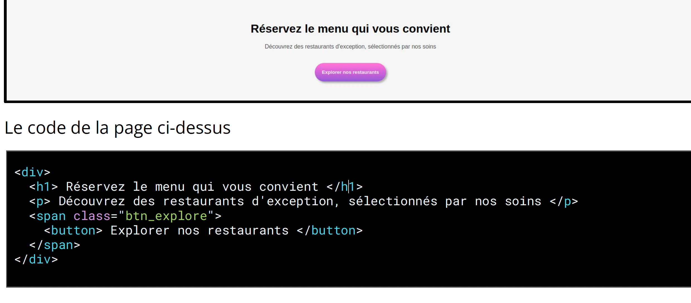
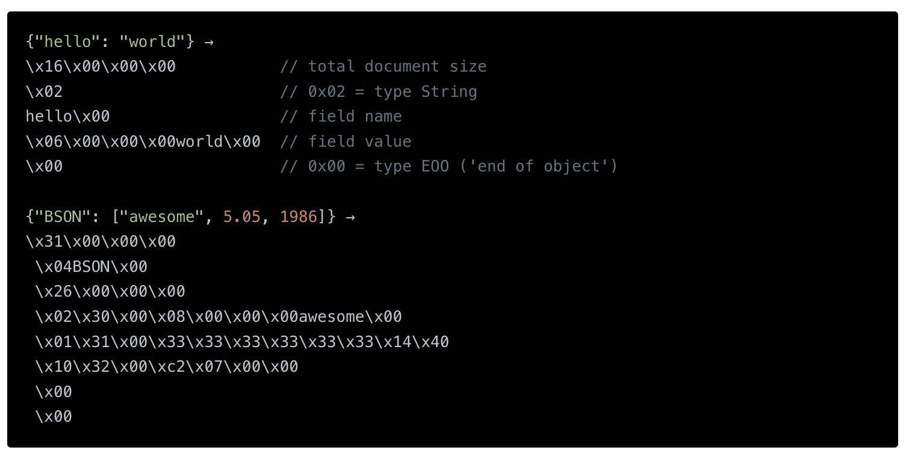
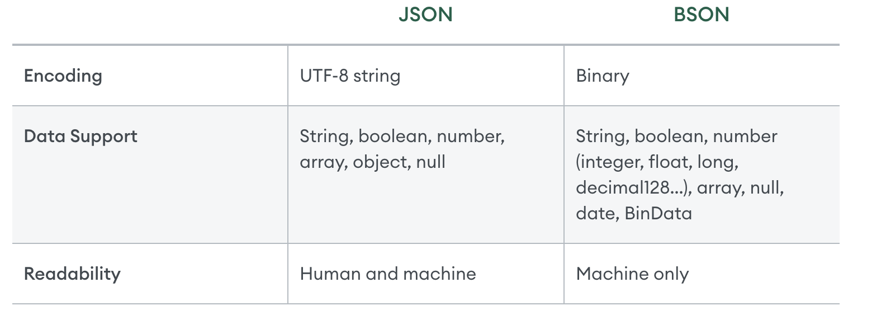

# MONGODB DOCUMENT

## I - Document
Lorsque nous entendons le mot document, nous faisons allusion à un traitement de
texte (Document word), à une feuille de calcul ou peut être un document papier.
Il y a plusieurs choses auxquelles on peut penser quand on entend le moment du
document.
On n’en fait aucunement allusion au NOSQL.
Voyons ce qu’est un document.

### 1 - Document HTML
 Soit la page HTML ci-dessous :
 
 ### 2 - Document JSON:
 ```
{
  "customer_id":187693,
  "name": "Kiera Brown",
  "address" : {
    "street" : "1232 Sandy Blvd.",
    "city" : "Vancouver",
    "state" : "Washington",
    "zip" : "99121"
  },
  "first_order" : "01/15/2013",
  "last_order" : "06/27/2014"
}
```
### 3 - Document
Pour résumer, un document est donc un ensemble de pair clé-valeur.Les clés sont
représentées sous forme de chaîne de caractère, et les valeurs peuvent avoir les types
scalaires(number,string,Boolean) ou des structures (arrays et objects)
Le document contient donc à la fois la structure et l’information.

# IV - Collection
* Une collection est un ensemble de documents.
* IL est important de remarquer que les documents au sein d’une collection peuvent avoir des
structures différentes
* Les documents à l’intérieur d’un sujet sont généralement liés à la même entité.Bien qu’il soit
possible de stocker des documents qui ne sont pas en relation dans un même document,cela est
déconseillé.

Exple : 
```
[
    {
    "customer_id":187693,
    "name": "Kiera Brown",
    "address" : {
        "street" : "1232 Sandy Blvd.",
        "city" : "Vancouver",
        "state" : "Washington",
        "zip" : "99121"
    },
    "first_order" : "01/15/2013",
    "last_order" : "06/27/2014"
    },
    {
    "customer_id":187694,
    "name": "Andrew Johson",
    "address" : {
        "street" : "1234 Sandy Blvd.",
        "city" : "Vancouver",
        "state" : "Washington",
        "zip" : "99121"
    },
    "first_order" : "01/15/2014",
    "last_order" : "06/27/2015"
    },
]
```
## II- Les types de données
Les types de données pris en charge par le JSON sont les suivants :
* String
* Number
* Boolean
* Object
* Array
* Null (Absence de valeur)

À ces types de données Mongodb en a rajouté qui sont les suivants :
* ObjectId
* Date
* NumberDecimal
* NumberInt
* NumberLong
* Timestamp
* BinaryData

## 1 - String
Le type String est une séquence de caractères.Mongodb stocke les chaînes dans le
format UTF-8
```
{ “nom”:”Dubois”}
//Dans le format JSON enveloppé une valeur par des doubles quotes, signifient que cette
dernière est de type string
{ “age”:”14”}
{ “date”:”12/12/2022”}
```
## 2 - Number
Le format JSON stocke les nombres sans donner plus de détails sur leur nature, c’està- dire si ce sont des entiers, des nombres à virgule etc …

Cependant Mongodb supporte les types de nombre suivant:
* double : 64 bit floating point
* int : 32 bit signed
* long: 64 bit unsigned
* decimal : 128 bit floating point - compatible avec le IEE 754

si programmez dans le shell Mongo, vous pouvez spécifier le type de nombre souhaité
au moyen des classes Suivantes :
```
let explicitInt = NumberInt(“1299”)
var explicitLong = NumberLong(“1233838484848848”)
var explicitDecimal = NumberDecimal(“233994.45”)
```
si vous communiqué avec mongo au moyen d’un langage de programmation, le driver
mongo dudit langage se chargera des conversions

## 3 - Boolean
Cet type ne peut que prendre l’une des valeurs de l’ensemble {false,true}
```
{“isUserLogged”:false}
{“isUserAdmin”:true}
```
## 4 - Object
Le champ object est utilisé pour représenter un objet frère ou un objet enfant.C’est un
autre champ dont la notation JSON est valide.
```

{
    “nom”:”Dubois”,
    “prenom”:”Durand”,
    “adresse”:{
        “code_postal”:”59000”,
        “ville”:”Lille”
    }
}
//Le champ adresse est ici de type objet, il est enfant du premier objet, qui ici pourrait
//correspondre à une personne
```
## 5 - Array
Le type tableau est une collection de zéro ou plusieurs valeurs.Le premier éléments
commencent à l’indice 0
```
var docIds = [1,2,8,9] // Tableau d’entier
var names = [“Elie”,”Eliane”] //Tableau de chaine de caractère
var objs = [{“_id”:1,”nom”:”test”},{“_id”:2,”nom”:”test2”}]// Tableau d’objet
```
## 6 - Type Null
Ce type est utilisé pour représenter l’absence de valeur. Ce type ne peut avoir que
comme valeur “null”
```
var nom = null
```
## 7 - Date
Le format JSON, ne supporte pas les types date, ils les traitent en chaîne de
caractère.MongoDB prévoit le type date, qui peut être créé avec le constructeur Date ou
ISODate()
```
var date = new Date() //ou
var date = new ISODate()
```
## 8 - ObjectId
Ce type est utilisé par mongoDb pour assigner une valeur par défaut au champ _id, du
document, lors de la création de ce dernier, si ce champ n’a pas été valorisé.
Ce type est composé de 12 bytes :
* 4 byte : représente le timestamp
* 5 à 9 bytes : pour une valeur aléatoire
* 3 bytes : un compteur incrémental

Cette valeur de type ObjectId est unique sur les différentes machines du cluster

## III - Format de stockage
Le format de stockage interne de MongoDB est le BSON qui signifie: "Binary JSON".
Un fichier BSON est la répresentation binaire du JSON

 

Comment se faire le stockage de la données en BSON


Comparaison BSON vs JSON
