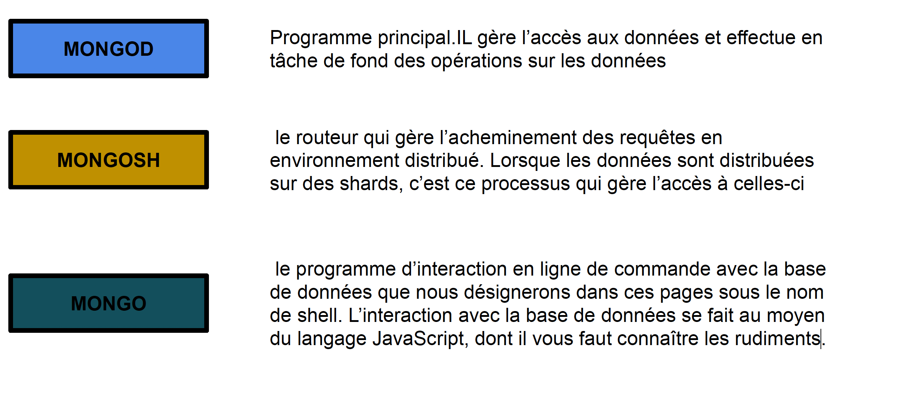
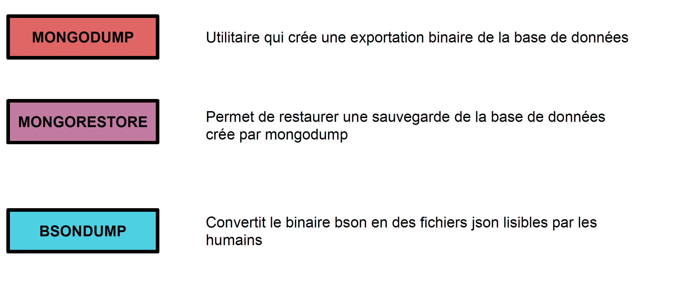
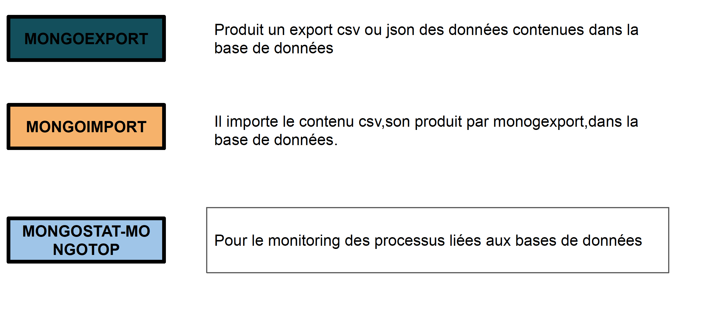
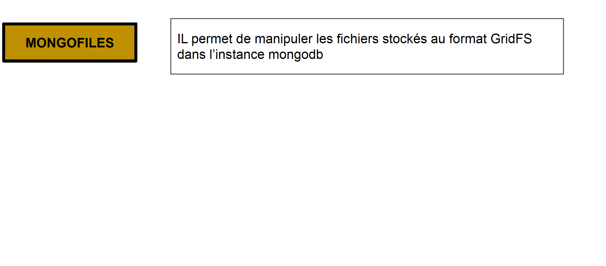

# MONGODB ARCHITECTURE ET INSTALLATION

## Architecture





## I - Installation MongoDB
https://www.mongodb.com/docs/manual/installation/

## II - Démarrage de la solution
#### Pour lancer mongodb en ligne de commande
* mongod --port 27017 --dbpath /data/db --logpath /tmp/mongodb.log --logappend

#### Sous Macos
* brew services start mongodb-community@8.0

Le fichier de configuration se trouve à l'emplacement : 
* /usr/local/etc/mongod.conf

#### Lancer le shell
* Lancement de l’environnement shell, ouvrez un autre terminal pour lancer le shell,
si votre commande mongodb exécutée précédemment, ne s’exécute pas en tâche
de fond. Par défaut, vous êtes connecté sur la base test.
```
mongosh
```
* Connection à un hôte mongo distant
```
mongosh --host <dns_hote_distant> --port <port_hote_distant>
```
## III - Commandes bases de données

* Afficher la liste des bases de données, tapez la commande suivante
```
show databases ou show dbs
```
* Pour savoir sur quelle base de données, vous êtes connecté, tapez la commande
```
db
```
* Voir la liste des collections
```
 show collections
```
* Changer de base de données
```
use <db_name>
```
* Création de base de données

créer la bd : "temporaire"
```
use temporaire
```
Avec le shell, la base de données n’est pas créé de façon explicite, c’est lors de la
création d’une collection que cette dernière est créé effectivement
```
db.macollection.insert({“ma_cle”:”ma_valeur”})
```

Convention de nommage d'une base de données mongodb
* Le nom de base ne doit pas être vide “”
* Le nom doit être une chaîne encodée en UTF-8
* Le nom de la base de données, ne doit contenir aucun des caractères suivants:
/,\,.,”,*,<,>,:,?,$,un espace,\0 (Le caractère null)
* Le nom de la base est sensible à la casse
* Le nom de la base de données est limitée à 64 bytes

Suppression de base de données
```
use temporaire
db.dropDatabase()
```

# IV - Configuration Mongodb dans le cloud
https://www.mongodb.com/docs/atlas/getting-started/

